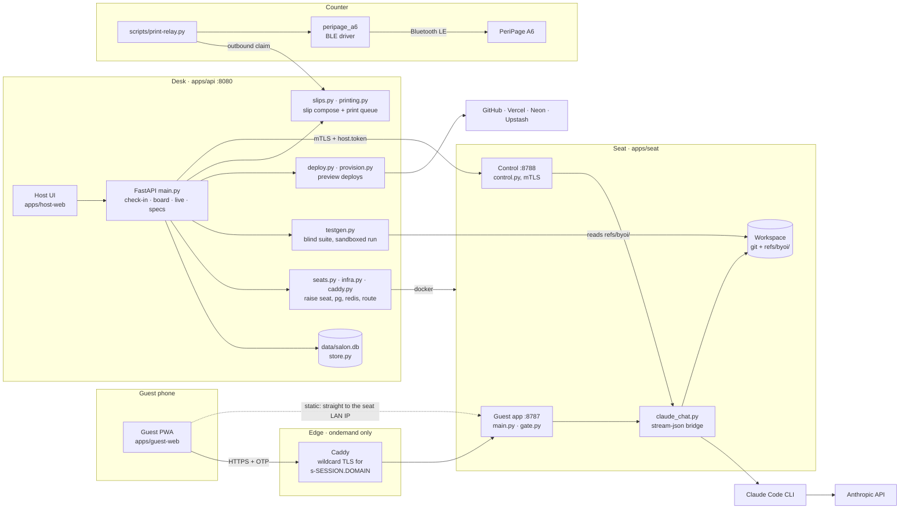
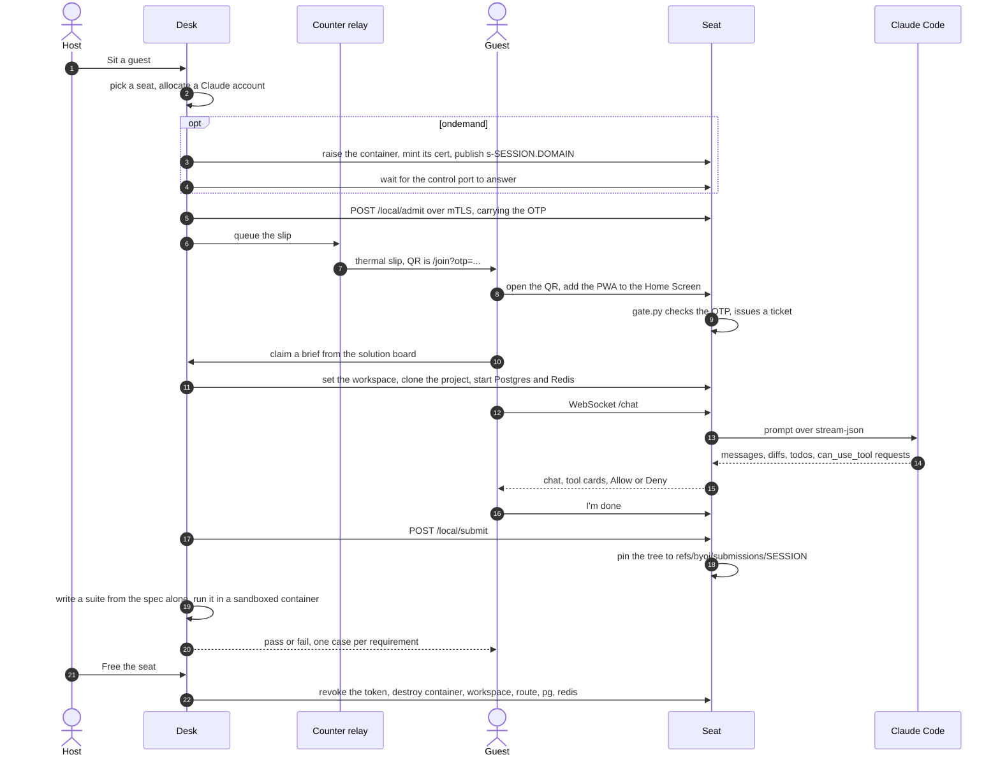

# BYOI — a salon for coding and wellness

A cafe floor where people come to build something. A guest sits down, takes a
printed slip, scans its QR, and codes through **Claude Code** from their own
phone — messages, diffs, tool cards, plan and code modes. No terminal, no
laptop, and no Claude account of their own.

Three parts make a visit:

* a **desk**, where the host checks guests in, keeps the solution board, and
  grades what gets shipped;
* a **seat**, which runs Claude Code and serves the guest's phone;
* a **counter printer**, which prints the slip that starts the visit.

It runs two ways. On **one salon PC**, seats are that PC and the phone is on its
Wi-Fi. On **a cloud VM**, the desk raises a seat container per visit at
`https://s-<session>.<domain>` with a real certificate, the phone can be on
cellular, and the thermal printer stays at the counter behind a small relay.

```
Desk  :8080   check-in, floor, solution board
Seat  :8786   HTTP UI on this PC (no cert warning)
Seat  :8787   HTTPS guest PWA for phones
Seat  :8788   mTLS control (desk → seat)
```

Full notes, including everything this page only summarises:
[`docs/salon.md`](docs/salon.md).

## Architecture



Three trust boundaries hold this together, and none of them is the network:

* **Desk → seat is a certificate**, not an address. Both ends trust only the
  salon CA, and `host.token` rides along as a second factor. Cafe DHCP moves;
  the certificate does not.
* **Guest → seat is the OTP**, then a ticket, with a lockout after eight
  failures. That is unchanged whether the phone is on the seat's Wi-Fi or on
  cellular through Caddy.
* **The seat never holds a credential the desk owns.** The guest's Claude has
  Bash and inherits the seat's environment, so the Docker socket, the Vercel
  token, and the grading account all stay on the desk. That is why the desk —
  not the seat — raises containers, grades, and deploys.

## A visit, end to end



The two halves that look like conveniences are the ones worth reading twice.
The OTP travels to the seat over mTLS and never over the guest's Wi-Fi, so a
phone on that network learns nothing by listening. And the suite is written
from the spec **before** anything reads the guest's code, so a solution cannot
shape the test that judges it.

## Running the salon

On one PC:

```bash
python3 -m venv .venv
source .venv/bin/activate
pip install -e ".[salon,dev]"
./scripts/salon-tls.sh
./scripts/salon-secrets.sh operator                      # desk sign-in password
./scripts/seat-claude-login.sh --account claude-seat-1   # then: claude auth login
./scripts/run-salon.sh           # desk
./scripts/run-seat.sh            # seat UI + guest PWA
```

In the cloud — one Linux VM with Docker, with `<domain>` and `*.<domain>`
pointed at it:

```bash
cp deploy/.env.example deploy/.env     # domain, ACME email, DNS provider token
./scripts/salon-secrets.sh operator
./scripts/salon-secrets.sh print-relay
./scripts/cloud-up.sh                  # Caddy + desk; seats appear at check-in
```

Then, on the machine with the printer:

```bash
BYOI_DESK_URL=https://<domain> PERIPAGE_MAC=… ./scripts/print-relay.py
```

| Open on this PC | URL |
|---|---|
| Desk | http://127.0.0.1:8080/ |
| Seat | http://127.0.0.1:8786/ |
| Guest (phone) | `https://<seat-lan-ip>:8787/guest/` |

The desk asks for the operator password — there is no same-machine shortcut, in
either mode. Behind a reverse proxy every request looks like it came from
`127.0.0.1`, so trusting that would open the floor to the internet rather than to
the counter. The slip QR is `https://<seat-ip>:8787/join?otp=…` on a salon PC and
`https://s-<session>.<domain>/join?otp=…` in the cloud.

**Floor / Solutions / Specs & QA / Live.** Desk tabs: seats, the solution
board, the acceptance specs and every graded visit, and a mirror of the guest
session. **Sit a guest** opens a centered QR — the image is the join code only;
the printer still gets the full thermal slip.
On the phone: scan, pick a solution, **Chat** — on the seat's Wi-Fi if the seat
is this PC, from anywhere if it is a cloud container. Claude Code runs on the
seat; the phone is messages, tools, diffs, files, photos, plan/code modes, and a
session timer.

**Your own Claude account.** A guest who already pays for Claude can tap **Use my
own Claude account** and run the session on theirs. They sign in on their own
phone — their password never reaches the seat — and the token that does is kept on
tmpfs and revoked and deleted when the seat is freed. It is a full-access Claude
Code token, not a narrowed one: the phone names what it can do before the guest
approves. It is also not private from the operator while the session runs.

**Solutions.** Each board item can have a **project** (new GitHub repo, clone,
or a folder on this PC). Claiming it sets the seat workspace to that folder.
An optional **acceptance spec** is graded when the guest taps **I'm done**, and
the phone shows pass/fail per requirement.

Grading runs on the **desk**, not the seat, and the suite is written from the
spec alone — with no tools, so it never reads the code it judges — then run in a
container with `--network none` and every `BYOI_*` value stripped. The seat only
pins the guest's tree to a ref under `refs/byoi/`; its `HEAD`, index, and working
tree are left untouched. Write and edit the specs on the desk's **Specs & QA**
tab, which is also the only place that keeps the history of graded visits — the
floor and board panels drop a visit the moment it completes.

**Deploy preview.** A brief whose project has a data layer can be shipped from
the phone: the desk fetches the pinned tree, provisions managed Postgres and
Redis, and runs `vercel` with its own token — which never goes near the seat,
because the guest's Claude has Bash there. If the brief has a spec, a smoke suite
runs against the live URL. Freeing the seat deletes the deployment, the Vercel
project, and the provisioned infrastructure.

The board a fresh desk opens with is `apps/api/seed_board.py` — today, the
fixes waiting on [The Fusion Studio](https://github.com/boscojacinto/thefusionstudio)
site. That repo is cloned on the first claim (or from the desk's **Fetch repo**
button), so startup stays offline.

`gh auth login` once if you create GitHub repos from the desk. New clones
land in `data/projects/`. On a salon PC, phone browsers warn on the salon CA
until `https://<seat-ip>:8787/ca.pem` is installed; in the cloud the certificate
is a real one and there is nothing to install.

## The printer

The slip is the front door of a visit, so the salon drives its own printer
rather than borrowing the operating system's. `src/peripage_a6/` is a userspace
Bluetooth driver for the **PeriPage A6 304dpi** pocket thermal printer — a
Python library plus a `peripage` CLI. It stands on its own, and is usable on its
own, but it is in this tree because of the slip.

The 304dpi A6 (sometimes labelled A6+ / `PeriPage+XXXX_BLE`) is not an ESC/POS
printer. Current units talk a proprietary session over **Bluetooth LE**, and
print a 576-pixel-wide 1-bit raster. This tree implements that protocol. It does
**not** target the older 203dpi A6 (384 px).

### The unit

| | |
|---|---|
| Model | PeriPage A6 304dpi / A6+ |
| Resolution | 304 dpi, 576 px wide (72 bytes/row) |
| Paper | 58 mm roll, ~48.5 mm printable |
| Transport | Bluetooth LE (gatttool). Not classic RFCOMM. |
| USB | not in this first cut |

### Install

The salon install above already includes the driver. For the driver on its own,
without the desk and seat:

```bash
python3 -m venv .venv
source .venv/bin/activate
pip install -e ".[dev]"
```

Needs BlueZ, including `gatttool` (usually the `bluez` package). Do **not**
install PyBluez.

### Connect it

Do **not** run `bluetoothctl pair`. On this 304dpi BLE model that fails with
`org.bluez.Error.AuthenticationFailed`, and BlueZ then tries classic RFCOMM
instead of LE.

1. Charge it (this unit reported 8% — it will drop the LE link when empty).
2. Power it on (green LED). Keep the official app off the printer.
3. Print. The driver opens an LE session itself:

```bash
peripage info C6:6C:09:0B:B2:50
```

Advertised name: `PeriPage+B250` / `PeriPage+B250_BLE`. No PIN.

### CLI

```bash
peripage discover
peripage discover --scan 8

peripage info AA:BB:CC:DD:EE:FF

peripage print AA:BB:CC:DD:EE:FF photo.png
peripage print AA:BB:CC:DD:EE:FF photo.png --dither atkinson --concentration dark
peripage print AA:BB:CC:DD:EE:FF --text "grocery list"
peripage print AA:BB:CC:DD:EE:FF --qr "https://example.com"
peripage print AA:BB:CC:DD:EE:FF --ascii "built-in font, 48 columns"

peripage feed AA:BB:CC:DD:EE:FF --dots 80
```

`--dump FILE` writes the protocol stream without opening Bluetooth. Useful
for tests and for inspecting a job:

```bash
peripage print 00:00:00:00:00:00 photo.png --dump /tmp/job.bin
xxd /tmp/job.bin | head
```

Dither options: `floyd-steinberg` (default, photos), `atkinson` (slightly
lighter), `threshold` (text / line art). Concentration: `light`, `medium`,
`dark`. Dark lasts longer on the paper and runs the head hotter.

### Library

```python
from peripage_a6 import Printer, Concentration, Dither, open_ble_transport

with Printer(open_ble_transport("C6:6C:09:0B:B2:50")) as printer:
    print(printer.info())
    printer.print_image("photo.png", dither=Dither.ATKINSON, concentration=Concentration.DARK)
    printer.print_text("hello from Python")
    printer.print_qr("https://example.com")
```

Swap the transport for `DumpTransport("job.bin")` to capture bytes. `--transport bleak`
uses BlueZ GATT via bleak (usually fails on this dual-mode firmware).
`--transport rfcomm` is only for older non-`_BLE` A6 units.

### How a job is sent

1. BLE GATT connect (write `0000ff02`, notify `0000ff01`), then vendor reset (`10 FF FE 01` + 12 zeros).
2. Set concentration.
3. `GS v 0` raster, 72 bytes/row, at most 255 rows per command.
4. `ESC J` paper feed, then vendor end-of-job (`10 FF FE 45`).

Writes are paced (~two rows / 15 ms) so the Bluetooth buffer does not
outrun the head. Details: [`docs/protocol.md`](docs/protocol.md).

### What the driver is not

- Not a CUPS driver. The library is the core a CUPS filter can sit on later.
- Not USB. Same raster commands, different pipe; left for a follow-up.
- Not the 203dpi A6. That head is 384 px / 48 bytes/row.

### Hardware notes

The head overheats on long solid-black jobs and silently drops rows (internal
buffer is only a few hundred pixels high). Pause between large pages. The
official app is still the only documented way to update firmware.

## Repo layout

| Path | What lives there |
|---|---|
| `apps/api/` | Desk — FastAPI, check-in, board, seats, grading, deploys, print queue |
| `apps/seat/` | Seat — guest app, OTP gate, mTLS control, Claude Code bridge |
| `apps/host-web/` · `apps/guest-web/` · `apps/coder/` | Desk UI, guest PWA, operator terminal |
| `apps/guest/` | Optional Expo app, for when a phone will not take the salon CA |
| `apps/templates/` | Project templates a brief can be seeded from |
| `scripts/` | Bring-up, TLS, secrets, backup, and the counter's print relay |
| `deploy/` | Dockerfiles, Compose, and the Caddyfile for the cloud shape |
| `src/peripage_a6/` | The printer driver: protocol, raster, transports, `peripage` CLI |
| `docs/` | [`salon.md`](docs/salon.md) (the floor) · [`protocol.md`](docs/protocol.md) (the printer) |
| `tests/` | The whole suite. No hardware, no network, no credentials |

## Tests

No hardware required:

```bash
pytest
```
